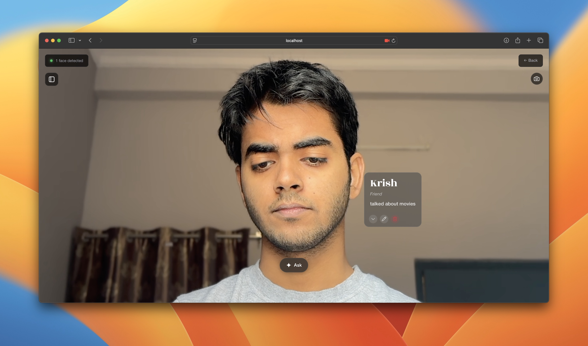

# RemindAR

A real-time face recognition system with AR overlays, designed to help people with memory challenges recognize and remember the people in their lives.

Try it Out at RemindAR.tech, it's fully deployed :)

---

## Demo Video

[](https://youtu.be/m9yXQxvuMcw)

[Watch on YouTube](https://youtu.be/m9yXQxvuMcw)

---

## Overview

RemindAR uses your webcam to detect faces, recognize identities, and display contextual information as floating labels. Think of it as a prototype for smart glasses that could help someone with dementia remember their family, caregivers, and friends.

**How it works:**
- Face detection runs in the browser using MediaPipe
- Face recognition uses InsightFace embeddings on the backend
- **Gemini 3.0 flash** for voice input transcription, extraction, and context queries
- Native **Hindi/Hinglish** support for multilingual users
- Data syncs between local SQLite and Firebase Firestore

---

## Screenshots





---

## Getting Started

### Requirements

- Python 3.9+
- Node.js 18+
- A webcam
- Gemini API key (get from [Google AI Studio](https://aistudio.google.com/app/apikey))

### 1. Backend Setup

```bash
cd backend

# Create and activate virtual environment
python -m venv .venv
source .venv/bin/activate

# Install dependencies
pip install -r requirements.txt

# Create .env file with your Gemini API key
echo "GEMINI_API_KEY=your-api-key-here" > .env

# Start the server
python main.py
```

### 2. Frontend Setup

```bash
cd frontend

npm install
npm run dev
```

Open `https://localhost:5173` and allow camera access.

> **Note**: HTTPS is required for camera/microphone access. The dev server uses a self-signed certificate.

---

## Features

### Face Detection & Recognition
- **MediaPipe** runs in-browser for fast, client-side detection
- **InsightFace** embeddings matched using cosine similarity on the backend
- Real-time WebSocket communication for instant results

### AR Face Labels (Redesigned)
- **Modern typography**: Rozha One serif for names, Helvetica Neue for details
- **Hover-activated blur box**: Appears on hover (desktop) or tap (mobile)
- **Auto-fade**: Box fades after 3 seconds of inactivity

### Pending People Notifications
- **Smart detection**: Unknown faces visible for 3+ minutes trigger a gentle notification
- **macOS-style alerts**: Beautiful slide-in notifications that ask "Save this person?"
- **Queue system**: Hit "Later" and the person gets saved in a collapsible queue
- **Auto-expiry**: Queue entries expire after 2 hours so you're never overwhelmed
- **One-tap save**: Add people from the queue anytime from the Dashboard

### Native Language Support
- **Speak in your language**: Voice registration works in English, Hindi, and Hinglish
- **Text-to-speech**: Dashboard reads person info aloud in your preferred language
- **Regional optimization**: Select your region for better voice recognition accuracy
- **No translation needed**: Just speak naturally and Gemini handles the rest

### Voice Registration (Gemini 3.0 flash)
- Speak naturally in your language
- Gemini transcribes + extracts structured data in ONE call
- Supports English, Hindi, and Hinglish out of the box

### Ask Gemini - Context Memory & Queries
- Tap the **Ask** button to query your contact memory
- Ask questions like "Who did I talk to about coffee?" or "When did I last see Sarah?"
- **Contextual search**: Gemini searches across names, relations, contexts, and timestamps
- **Smart insights**: Get matched people with full context and dates
- **Conversation history**: See when you last met each person
- **Natural responses**: Gemini answers in plain language, like a helpful assistant

### Dashboard Sidebar
- **Swipeable cards**: iOS-style swipe-to-reveal edit/delete actions
- **Search**: Filter by name, relation, or context
- **Newest first**: Most recent entries appear at the top
- **Text-to-speech**: Read person info aloud
- **Pending queue**: Collapsible section shows people you've chosen to save for later
- **Quick actions**: Add or remove pending people with unified button styling

### Mobile & iOS Support
- **Fullscreen camera** on mobile devices
- **PWA ready**: Add to home screen for standalone mode
- **HTTPS**: Required for camera/mic access on iOS
- **Proxy configuration**: Mobile devices connect through Vite proxy

---

## Registering Faces

Three ways to save people:

### 1. Instant Registration
1. Click "Add this person" on an unknown face
2. Click "Speak" and say something like: "That's Sarah, my doctor, she prescribed medication"
3. Form auto-fills with extracted info (name, relation, context)
4. Click Save

### 2. Pending Notifications
1. Talk to someone for 3+ minutes
2. RemindAR shows a notification: "Save this person?"
3. Choose "Yes" to register immediately, "Later" to save for later, or "No" to dismiss

### 3. From the Queue
1. Open the Dashboard sidebar
2. Click "Queue (n)" to see pending people
3. Review and add them when you're ready (or they'll expire in 2 hours)

---

## Architecture

```
Frontend (React + TypeScript + Vite)
├── MediaPipe face detection (in-browser)
├── WebSocket for face recognition
├── AR overlay with CSS blur effects
├── Swipeable dashboard cards
└── Ask Gemini voice queries

Backend (FastAPI + Python)
├── InsightFace recognition
├── Gemini 3.0 flash (transcription + extraction + queries)
└── SQLite + Firebase storage
```

### Gemini Integration

Gemini 3.0 flash powers three major features:

```
Voice Registration:
User speaks (any language) → Gemini 3.0 flash → { transcription, name, relation, context }
                              (single API call)

Context Memory Queries:
User asks "Who did I meet last week?" → Gemini 3.0 flash → { answer, matched people, dates }
                                         (searches your database + timestamps)

Regional Voice Optimization:
Select your region → Optimized voice recognition → Better accuracy in your language
                                  
Benefits:
✅ Hindi/Hinglish works seamlessly
✅ Single API call (blazing fast)
✅ Better context understanding
✅ No local model downloads
✅ Natural conversation history tracking
```

---

## Project Structure

```
RemindAR/
├── backend/
│   ├── main.py              # FastAPI server
│   ├── face_recognition.py  # InsightFace
│   ├── gemini_stt.py        # Voice transcription + extraction
│   ├── ask_gemini.py        # Context memory queries
│   ├── config.py            # API key configuration
│   ├── database.py          # SQLite
│   └── firebase_sync.py     # Firestore sync
│
├── frontend/
│   ├── src/
│   │   ├── App.tsx
│   │   ├── components/
│   │   │   ├── AROverlay.tsx                  # Face labels with hover box
│   │   │   ├── AskGeminiButton.tsx            # Voice query button
│   │   │   ├── DashboardSidebar.tsx           # People management + pending queue
│   │   │   ├── SwipeableCard.tsx              # iOS-style swipe cards
│   │   │   ├── PendingPersonNotification.tsx  # macOS-style notifications
│   │   │   └── GeminiResponseOverlay.tsx      # Context query results
│   │   ├── hooks/
│   │   │   ├── useFaceDetection.ts
│   │   │   ├── useWebSocket.ts
│   │   │   ├── useSpeechToText.ts
│   │   │   ├── usePendingPeople.ts            # Notification system
│   │   │   └── useUserRegion.ts               # Language region selector
│   │   └── styles/
│   │       └── index.css                      # Global styles + fonts
│   ├── public/
│   │   ├── fonts/                             # Helvetica Neue, Rozha One
│   │   └── manifest.json                      # PWA config
│   └── vite.config.ts                         # HTTPS + proxy config
│
└── README.md
```

---

## Configuration

**Backend**: Runs on port 8000

**Frontend**: Vite dev server runs on port 5173 with HTTPS

**Gemini API**: Add your key in `backend/.env`:
```env
GEMINI_API_KEY=your-key-here
```

**Firebase**: Place `firebase-credentials.json` in backend directory. Falls back to SQLite-only if not present.

---

## Troubleshooting

**Voice extraction not working**  
Check that your Gemini API key is set in `backend/.env`

**Camera not working**  
Check browser permissions. HTTPS is required for camera access.

**Faces not recognized**  
Register faces first. Good lighting helps.

**Mobile not connecting**  
Ensure your phone is on the same network. Use the Vite proxy (requests go through frontend server).

---

## Tech Stack

- **Frontend**: React, TypeScript, Vite, GSAP
- **Detection**: MediaPipe Face Detection
- **Recognition**: InsightFace
- **AI**: Gemini 3.0 flash (transcription, extraction, queries)
- **Storage**: Firebase Firestore, SQLite
- **Fonts**: Rozha One, Helvetica Neue

---

## License

MIT

---

## What Makes RemindAR Special

RemindAR isn't just another face recognition app. It's designed from the ground up for people dealing with memory challenges, whether from dementia, Alzheimer's, or just the general chaos of meeting too many people.

**The thoughtful bits:**
- Notifications only appear after 3+ minutes of conversation, so you're not bombarded constantly
- The "Later" queue lets you defer decisions without losing track of people
- Native language support means grandma can use it in Hindi without switching mental gears
- Context queries remember not just who people are, but when you last saw them and what you talked about
- Everything expires gracefully - queued faces disappear after 2 hours so you're not managing ancient unknowns

**The technical bits:**
- Client-side face detection means your video never leaves your device
- WebSocket recognition is instant - no waiting around for HTTP requests
- Gemini does the heavy lifting for voice and context, so no massive model downloads
- Firebase sync means your data follows you across devices
- PWA support means it works like a native app on your phone

Built with care for people with memory challenges and their caregivers.
